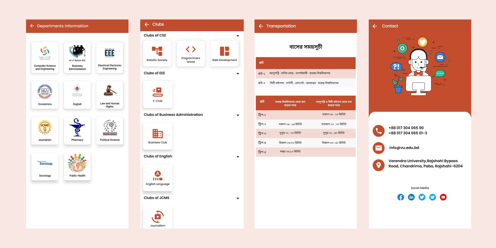
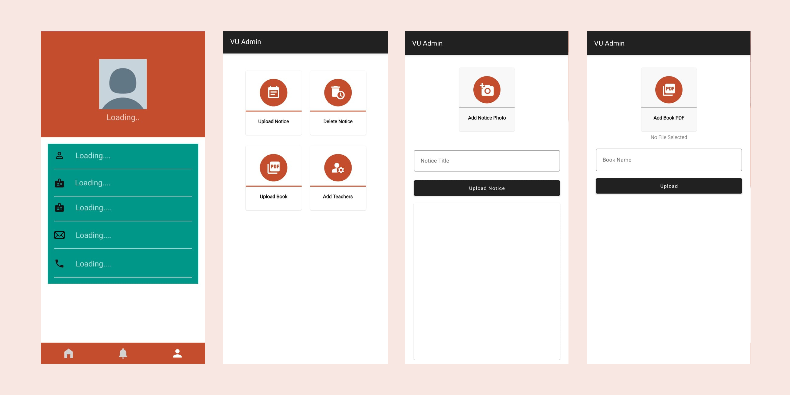
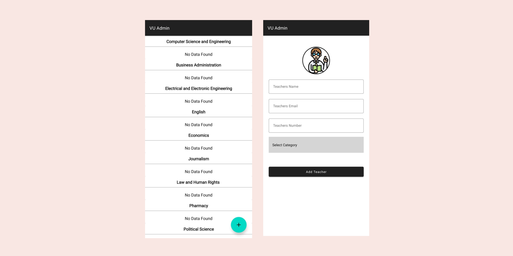

<h2>Features</h2>
<h3>Main University App</h3>
<ul>
    <li>View university news and announcements</li>
    <li>Access course materials and schedules</li>
    <li>Check exam results and grades</li>
    <li>View faculty and staff details</li>
    <li>Notifications for important updates</li>
    <li>User-friendly interface for students</li>
</ul>

<h3>Admin App</h3>
<ul>
    <li>Upload university information and announcements</li>
    <li>Manage student records and faculty details</li>
    <li>Upload and update course materials</li>
    <li>Manage exam schedules and results</li>
    <li>Secure admin login panel</li>
</ul>

<h2>Installation</h2>
<ol>
    <li><strong>Clone the Repository:</strong></li>
    <pre><code>git clone https://github.com/themdratanali/university-apps-for-students</code></pre>
    <li><strong>Open the Project in Android Studio:</strong></li>
    
Import the project and let Gradle sync.

    <li><strong>Build and Run the App:</strong></li>
    
Ensure you have an Android device/emulator ready. Click the "Run" button in Android Studio.

</ol>

<h2>Requirements</h2>
<ul>
    <li>Java (JDK 8 or above)</li>
    <li>Android Studio (Latest version recommended)</li>
    <li>Firebase (for data storage and authentication)</li>
    <li>Internet connection</li>
</ul>

<h2>Project Structure</h2>
<pre><code>root-directory/
│-- main-university-app/  # Student application source code
│-- admin-app/            # Admin application source code
│-- README.md             # Project documentation
│-- LICENSE               # License information
</code></pre>

<h2>Usage</h2>
<h3>For Students:</h3>
<ul>
    <li>Download the Main University App.</li>
    <li>Sign in with your student credentials.</li>
    <li>Browse available resources and updates.</li>
</ul>

<h3>For Admins:</h3>
<ul>
    <li>Use the Admin App to upload information.</li>
    <li>Ensure data is accurate and up to date.</li>
</ul>

<h2>App Screenshots</h2>

<h2>Contribution</h2>
<ol>
    <li>Fork the repository.</li>
    <li>Create a new branch (<code>feature-xyz</code>).</li>
    <li>Commit your changes.</li>
    <li>Push to your fork and create a pull request.</li>
</ol>

<h2>Contact</h2>

<strong>Developer:</strong> Md. Ratan Ali

<strong>Email:themdratanali@gmail.com</strong>themdratanali@gmail.com

